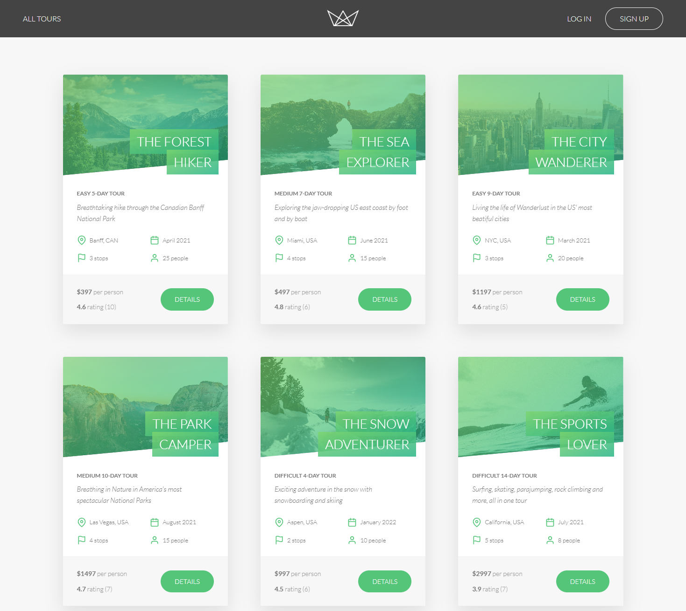

# Natours

This project was created as part of a **Node.js development** Udemy course.  
It focuses on building a modern **RESTful API** with authentication, database management, and server-side rendering.

## 🚀 Features
- **Node.js & Express** – Backend API built with modern JavaScript.  
- **MongoDB & Mongoose** – NoSQL database with schema-based validation.  
- **Authentication & Authorization** – Secure login, signup, and role-based access.  
- **RESTful API** – Follows best practices for API design and structure.  
- **Server-Side Rendering** – Uses **Pug templates** for dynamic page rendering.  

## 📅 Project Details
- **Course**: Udemy - Node.js, Express, MongoDB & More: The Complete Bootcamp
- **Year**: 2023
- **Technologies**: Node.js, Express, MongoDB, Mongoose, Pug

## 📸 Preview  
  

---

⭐ This was a learning project and is not actively maintained.
